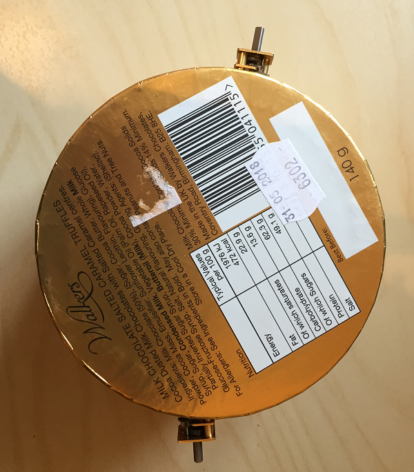
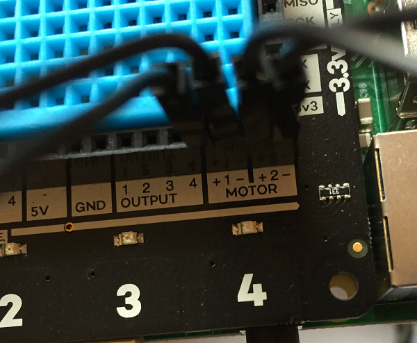

# Explorer HAT buggy

In this resource you will make a very simple buggy, with an optional GUI interface to control it remotely from another computer.

## Choosing a chassis

To make a buggy, you will need to create a chassis so that you can attach the wheels. This is harder than it looks! We chose to use a small chocolate box because it is made of stiff cardboard and about the right size to hold the Raspberry Pi and the USB power stick. You might have a suitable box, or you might wish to create a chassis from other materials such as Lego, or even to 3D print your chassis.

## Add wheels

1. Ask an adult to help you with this step. Using a pair of scissors or a sharp instrument, carefully make a hole near the bottom of your box.

    

1. Once the hole is big enough, push your motor into the hole so that the shaft of the motor is on the outside of the box. Be careful not to bend or break the pins on your motor when you push it through.

    

1. Repeat these steps on the opposite side of your box to add the second motor. Our buggy only has two wheels, but if you want to add an axle with two non-powered wheels to stabilise your buggy, add that now.

    

1. Push a tyre onto each motor shaft and connect two jumper wires to each motor.

    

## Connect the Raspberry Pi

1. Connect the Explorer HAT to your Raspberry Pi

    

1. On the Explorer HAT, locate the two holes labelled "Motor 1" - one is `+` and the other `-`. Take two jumper leads connected to the **same** motor and push them into the holes for motor one. It does not matter which way around the leads go.

    

1. Repeat this step, pushing the two leads from the other motor into the holes on the Explorer HAT labelled "Motor 2".

    

1. Attach the USB power pack and put the Raspberry Pi into the chassis.
    
